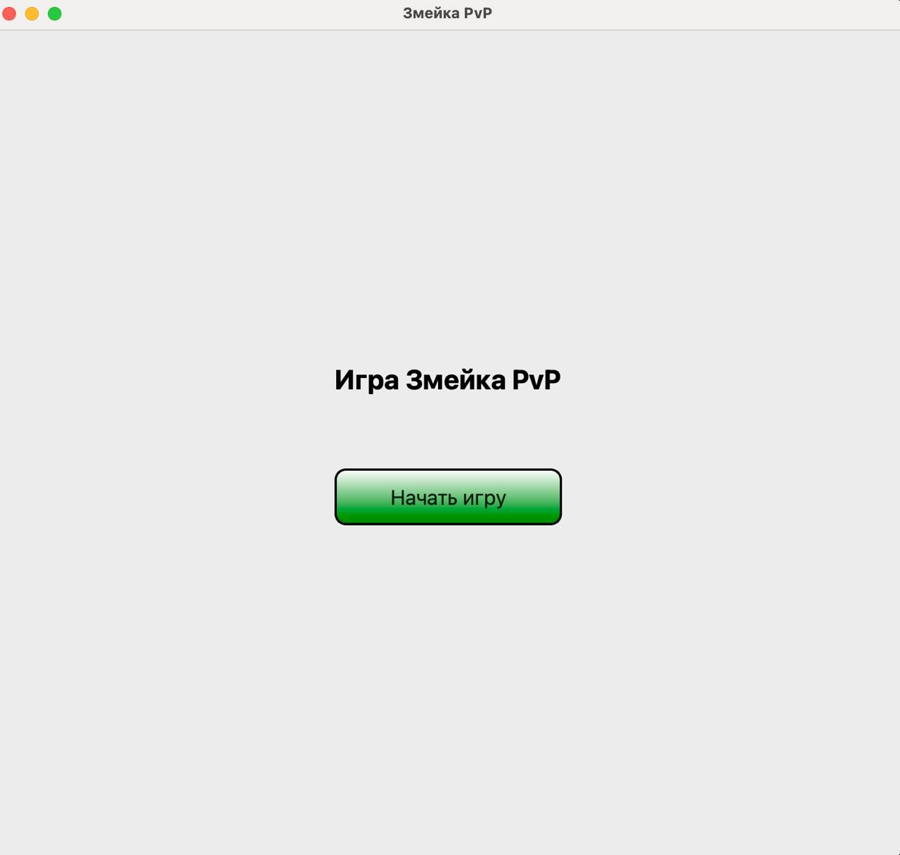
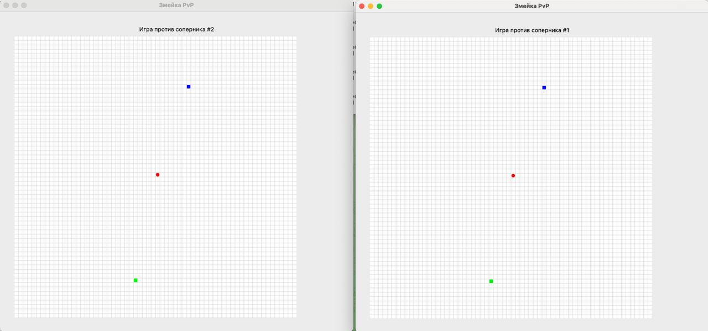
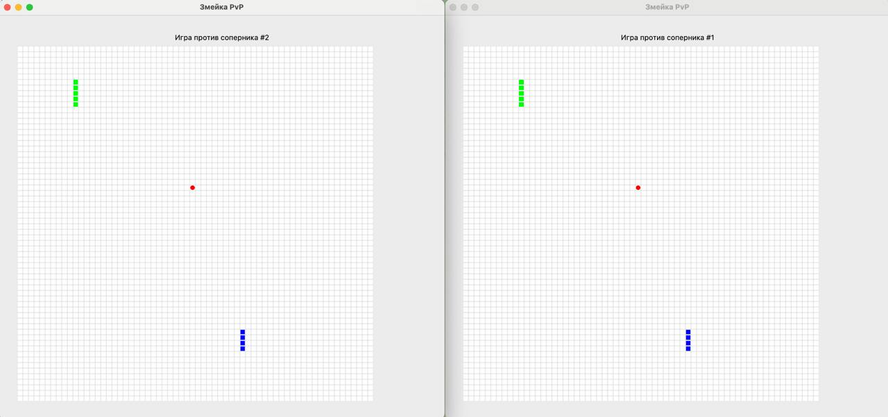
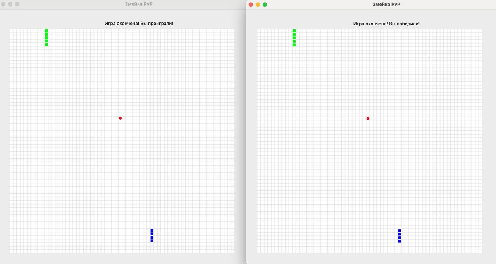

## PVP snake game
A multiplayer Snake game, developed using C++, Boost and Qt. The game includes a server part that processes the game logic, and a UI client part.

### Screenshots

### Project Features
* Multiplayer game "Snake" in PvP mode
* Networking using WebSocket
* Multithreaded processing on server and client
* Full localization of the interface (support for English and Russian languages)
* Testing of all components using Google Test

### Dependencies
* The server part:
  * C++17 or higher
  * Boost (system, thread)
  * lohmann/json (for working with JSON)
* The client part:
  * C++17 or higher
  * Qt 6 (Core, Gui, Widgets, Network, Websocket, LinguistTools)
* Testing:
  * Google Test
  * Qt Test
